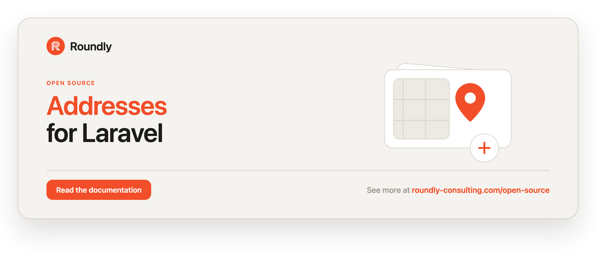

<!-- roundly-hero:start -->
<p align="center">
  <a href="https://roundly-consulting.com/open-source/docs/addresses-for-laravel?utm_source=github&utm_medium=readme&utm_campaign=open-source&utm_content=addresses-for-laravel">
    
  </a>
</p>
<!-- roundly-hero:end -->

<!-- roundly-badges:start -->
<p align="center">
  <a href="https://packagist.org/packages/roundly-consulting/addresses-for-laravel"></a>
  <a href="https://github.com/roundly-consulting/addresses-for-laravel/actions/workflows/run-tests.yml"></a>
  <a href="https://github.com/roundly-consulting/addresses-for-laravel/actions/workflows/fix-php-code-style-issues.yml"></a>
  <a href="https://donate.stripe.com/dRmeVe8FX5PF1Qd9pXcEw00"></a>
  <a href="https://www.patreon.com/cw/roundly"></a>
  <a href="https://roundly-consulting.com/support-us?utm_source=github&utm_medium=readme&utm_campaign=open-source&utm_content=addresses-for-laravel#crypto"></a>
</p>
<!-- roundly-badges:end -->

# Addresses for Laravel

Store billing, shipping, or other addresses on any Eloquent model via a polymorphic
relationship. Add the `HasAddresses` trait to a model and attach as many typed addresses as
you need, with a fluent builder, a typed `AddressType` enum, primary-address handling (one
primary per owner and type, promoted atomically), country-code normalisation, query scopes,
events, an API resource, and test helpers.

## Requirements

- PHP 8.4+
- Laravel 12 or 13

### Integrates with

- [`package-toolkit-for-laravel`](https://github.com/roundly-consulting/package-toolkit-for-laravel) —
  the package is bootstrapped with the toolkit's `PackageServiceProvider`, so its config, the
  publishable migration and the facade alias are wired through the shared builder, the configured
  model is resolved through the toolkit's `ModelResolver`, and `php artisan about` reports the
  addresses setup.

## Installation

Install the package via Composer:

```bash
composer require roundly-consulting/addresses-for-laravel
```

Publish and run the migration. The migration is **not** loaded automatically — publishing it is
required, and the published copy is yours to edit. If the models that own addresses use UUID or
ULID keys, set `ADDRESSES_KEY_TYPE` (see [Configuration](#configuration)) **before** migrating:
it decides the type of the `addressable_id` column.

```bash
php artisan vendor:publish --tag="addresses-migrations"
php artisan migrate
```

Optionally publish the config file:

```bash
php artisan vendor:publish --tag="addresses-config"
```

## Configuration

The published config file (`config/addresses.php`):

```php
use RoundlyConsulting\Addresses\Address;
use RoundlyConsulting\Addresses\Enums\AddressType;

return [
    'model' => Address::class,
    'key_type' => env('ADDRESSES_KEY_TYPE', 'bigint'),
    'default_type' => AddressType::Default->value,
    'normalise_country' => true,
    'country_resolver' => null,
    'facade_alias' => 'Addresses',
];
```

| Key                 | Type                  | Default              | Purpose                                                                                              |
|---------------------|-----------------------|----------------------|------------------------------------------------------------------------------------------------------|
| `model`             | `class-string`        | `Address::class`     | The model the trait/facade read and write through. Swap it for a subclass to customise behaviour.    |
| `key_type`          | `string`              | `'bigint'`           | Env `ADDRESSES_KEY_TYPE`. Key type of the polymorphic `addressable_id` column: `bigint`, `uuid` or `ulid`, matching your owners' primary keys (all owners must share one). Read by the migration, so set it **before** `php artisan migrate`; any other value throws `InvalidConfigurationException`. |
| `default_type`      | `string`              | `'default'`          | The `AddressType` value an address gets when its creator names none (the builder without `type()`, `AddressData` without `type`, `createAddress()` without `type`). A value that is not an `AddressType` case (blank strings included; matching ignores case and padding) throws `InvalidAddressTypeException`; `null` means `default`. |
| `normalise_country` | `bool`                | `true`               | Trim, upper-case, and check that country codes are two or three letters on the way in. `false` (or `'false'`/`'0'`/`'off'` from env) stores them as given; any other non-boolean value throws `InvalidConfigurationException`. |
| `country_resolver`  | `class-string\|null`  | `null`               | Optional host implementation of `CountryResolver` used to resolve country names (and geocode). `null` binds none; any other value must name a `CountryResolver` class, or resolving it throws `InvalidConfigurationException`. |
| `facade_alias`      | `string\|null`        | `'Addresses'`        | The global class alias registered for the facade. A string renames it; `null` skips it entirely (the package declares no other alias). |

Country codes are **shape-checked, not looked up**: the package bundles no country list, so
`xx` is accepted as `XX`, and an alpha-3 code stays alpha-3 (`svk` → `SVK`). Store one style
consistently — `inCountry('SK')` does not match a row stored as `SVK`.

## Usage

### Add the trait

```php
use Illuminate\Database\Eloquent\Model;
use RoundlyConsulting\Addresses\Traits\HasAddresses;

class Payer extends Model
{
    use HasAddresses;
}
```

### Address types

`type` is a backed enum, `RoundlyConsulting\Addresses\Enums\AddressType`, with the cases
`Default`, `Billing`, `Shipping`, `Home`, `Work`, and `Office`. Each case has a `label()`
for UI. Address types are enum-only across the whole public API.

```php
use RoundlyConsulting\Addresses\Enums\AddressType;

AddressType::Office->value;   // 'office'
AddressType::Office->label(); // 'Office'
```

### Create an address — fluent builder

`Addresses::for($owner)` returns the owner's **address book**; its `new()` starts a fluent
`PendingAddress` builder (the `newAddress()` model helper does the same). Country codes are
normalised automatically, and an address with no `type()` gets the configured `default_type`:

```php
use RoundlyConsulting\Addresses\Enums\AddressType;
use RoundlyConsulting\Addresses\Facades\Addresses;

Addresses::for($payer)->new()
    ->type(AddressType::Office)
    ->name('HQ')
    ->primary()
    ->in('Bratislava')->at('Somewhere 1')->postalCode('81101')->country('sk')
    ->meta(['floor' => 3])
    ->save();

// or from the model
$payer->newAddress()
    ->type(AddressType::Home)
    ->in('Košice')->at('Main 2')->postalCode('04001')->country('SK')
    ->save();
```

Calling `save()` without `in()`, `at()`, `postalCode()`, and `country()` throws
`IncompleteAddressException`.

### Create an address — DTO / programmatic

```php
use RoundlyConsulting\Addresses\DataTransferObjects\AddressData;
use RoundlyConsulting\Addresses\Enums\AddressType;

Addresses::for($payer)->add(AddressData::make(
    city: 'Bratislava',
    street: 'Somewhere 1',
    postalCode: '81101',
    countryIso: 'SK',
    type: AddressType::Office,
    isPrimary: true,
));

// The same through the model trait:
$payer->addAddress($data);
```

Or pass the fields as named arguments with `$payer->createAddress(city: …, street: …,
postalCode: …, countryIsoCode: …, type: AddressType::Office)`. Leave `type` out of any of
these and the address gets the configured `default_type`.

`meta` is stored as JSON and cast back to an `Illuminate\Support\Collection`.

### Read addresses

```php
use RoundlyConsulting\Addresses\Enums\AddressType;

$book = Addresses::for($payer);

$book->all();                                        // Collection<Address>, oldest first
$book->primary();                                    // primary across all types (or null)
$book->primary(AddressType::Office);                 // primary of a type
$book->ofType(AddressType::Shipping);                // collection of a type

// Model trait shortcuts (they go through the same book):
$payer->addresses;                                   // all addresses (relation)
$payer->getAddressOfType(AddressType::Home);         // first of a type
$payer->getPrimaryAddressOfType(AddressType::Office); // first primary of a type (or null)
$payer->primaryAddress();                            // primary across all types
$payer->primaryAddress(AddressType::Office);         // primary of a type
$payer->addressesOfType(AddressType::Shipping);      // collection of a type
$payer->hasAddresses();                              // bool
```

### Query scopes

```php
use RoundlyConsulting\Addresses\Address;
use RoundlyConsulting\Addresses\Enums\AddressType;

Address::query()->primary()->get();
Address::query()->ofType(AddressType::Billing)->get();
Address::query()->inCountry('SK')->get();
```

`inCountry()` matches codes the way they were stored: with `normalise_country` on it
upper-cases its argument (`' sk '` finds `SK`); with it off it compares case-insensitively
(`'SK'` finds a verbatim `sk`). Alpha-2 and alpha-3 codes are never mapped onto each other.

### Manage the primary address

An owner has at most one primary address per type. Promoting one — through `setPrimary()`,
or by adding/updating an address with `isPrimary: true` / `->primary()` — demotes the others in
the same owner + type group, in one transaction under a lock on the group, so a failure half-way
leaves the old primary in place and two concurrent promotions cannot both win. On PostgreSQL and
SQLite a partial unique index also makes a second live primary impossible at the database level
(soft-deleted rows hold no slot).

The book refuses an address that belongs to another owner (`AddressOwnershipException`) and a
soft-deleted one (`TrashedAddressException` — restore it first). Both are checked against the
stored row, not the copy you pass in:

```php
$address = Addresses::for($payer)->ofType(AddressType::Office)->first();

Addresses::for($payer)->setPrimary($address);   // promote this, demote siblings
$payer->setPrimaryAddress($address);            // trait shortcut, same guard
```

### Update or delete an address

```php
Addresses::update($address, AddressData::make(
    city: 'Košice', street: 'Main 2', postalCode: '04001', countryIso: 'SK', isPrimary: true,
));                                             // dispatches AddressUpdated

Addresses::delete($address);                    // soft delete, dispatches AddressDeleted
```

`update()` overwrites the address with the data you pass, including its flag: `isPrimary: true`
promotes it, and leaving `isPrimary` out (it defaults to `false`) demotes it.

Deleting the primary leaves its type without one until you promote another. The deleted address
keeps its flag, so `$address->restore()` undoes the delete — it comes back as the primary only
while its owner + type group has no other live primary; otherwise it returns as a plain address.

### Format an address

```php
$payer->primaryAddress()?->formatted();
// "HQ, Somewhere 1, 81101 Bratislava, SK"

$address->formatted(' | '); // custom separator; empty parts are skipped
```

### Country names (optional resolver)

The package shape-checks and normalises country codes but ships no country list or geocoder. To resolve names (or coordinates), implement `CountryResolver` in your app and
register it in config:

```php
use RoundlyConsulting\Addresses\Contracts\CountryResolver;
use RoundlyConsulting\Addresses\DataTransferObjects\AddressData;
use RoundlyConsulting\Addresses\DataTransferObjects\Coordinates;

class AppCountryResolver implements CountryResolver
{
    public function name(string $iso): ?string { /* ... */ }
    public function coordinates(AddressData $data): ?Coordinates { /* ... */ }
}
```

```php
// config/addresses.php
'country_resolver' => \App\Support\AppCountryResolver::class,
```

With a resolver bound, `$address->country_name` returns the resolved name; without one it is
`null`. `Addresses::countryName('sk')` returns the resolved name and falls back to the
normalised ISO code (`'SK'`) when no resolver is bound or it does not know the code.

### Events

The package dispatches:

- `AddressCreated` — after an address is created
- `AddressUpdated` — after an address is updated through `Addresses::update()`
- `AddressDeleted` — after an address is deleted
- `PrimaryAddressChanged` — whenever an address becomes the primary of its type: `setPrimary()`,
  adding one with `isPrimary: true` / `->primary()`, or updating one with `isPrimary: true`. It
  fires after `AddressCreated` / `AddressUpdated`, once the promotion is written, and not when
  the address already was the primary.

Each event exposes the related `$address`.

### API resource

`RoundlyConsulting\Addresses\Http\Resources\AddressResource` renders an address with a
stable shape (id, type, name, lines, country ISO/name, `is_primary`, `formatted`, meta,
timestamps):

```php
use RoundlyConsulting\Addresses\Http\Resources\AddressResource;

return AddressResource::collection($payer->addresses);
```

### Use a custom model

Point the config at your own subclass:

```php
namespace App\Models;

use RoundlyConsulting\Addresses\Address as BaseAddress;

class Address extends BaseAddress
{
    protected $table = 'addresses';
}
```

```php
// config/addresses.php
'model' => \App\Models\Address::class,
```

### Without the facade

The facade is sugar over the injectable `AddressManager`; each use case is also an action
class. All three run the same code:

```php
use App\Models\User;
use RoundlyConsulting\Addresses\Actions\CreateAddressAction;
use RoundlyConsulting\Addresses\Address;
use RoundlyConsulting\Addresses\AddressManager;
use RoundlyConsulting\Addresses\DataTransferObjects\AddressData;

final class SaveBillingAddress
{
    public function __construct(private AddressManager $addresses) {}

    public function __invoke(User $user, AddressData $data): Address
    {
        return $this->addresses->for($user)->add($data);
    }
}

app(CreateAddressAction::class)->execute($user, $data);   // the raw action
```

| Facade | Action |
|---|---|
| `Addresses::for($o)->add($data)` / `->new()->…->save()` | `CreateAddressAction` |
| `Addresses::for($o)->setPrimary($address)` | `SetPrimaryAddressAction` |
| `Addresses::update($address, $data)` | `UpdateAddressAction` |
| `Addresses::delete($address)` | `DeleteAddressAction` |

## Testing

`Addresses::fake()` swaps the manager — for the facade *and* for anything that injects
`AddressManager` — with a recording fake that writes nothing. Added addresses stay in memory
(unsaved), and the owner's reads (`all()`, `ofType()`, `primary()`) answer from the stored rows
with the fake's adds, updates, deletes and primary changes applied — so `primary()` returns what
the real manager would after the same calls. Ownership is still enforced, and so is the refusal
to promote a deleted address. Calls through the `HasAddresses` trait are recorded too:

```php
use RoundlyConsulting\Addresses\DataTransferObjects\AddressData;
use RoundlyConsulting\Addresses\Facades\Addresses;

$fake = Addresses::fake();

$user->addAddress($data);                       // your code under test
Addresses::for($user)->setPrimary($address);

$fake->assertAdded($user, fn (AddressData $d) => $d->city === 'Bratislava');
$fake->assertPrimarySet($address);
$fake->assertNothingDeleted();
```

| Assertion | Negative |
|---|---|
| `assertAdded(?Model $to = null, ?Closure $where = null)` | `assertNothingAdded()` |
| `assertUpdated(?Address $address = null, ?Closure $where = null)` | `assertNothingUpdated()` |
| `assertDeleted(?Address $address = null)` | `assertNothingDeleted()` |
| `assertPrimarySet(?Address $address = null)` | `assertNothingPrimarySet()` |

For database-backed tests, the `InteractsWithAddresses` trait adds expressive assertions:

```php
use RoundlyConsulting\Addresses\Enums\AddressType;
use RoundlyConsulting\Addresses\Testing\InteractsWithAddresses;

uses(InteractsWithAddresses::class);

$this->assertHasAddress($payer, ['city' => 'Bratislava']);
$this->assertPrimaryAddress($payer, AddressType::Office);
```

Run the package test suite with:

```bash
composer test
```

## Changelog

Please see [CHANGELOG](CHANGELOG.md) for what has changed recently.

<!-- roundly-support:start -->
## Support our work

This package is free and open source, built and maintained by
[Roundly Consulting](https://roundly-consulting.com/open-source?utm_source=github&utm_medium=readme&utm_campaign=open-source&utm_content=addresses-for-laravel).
If it saves you time, please consider supporting our open-source work — a one-time donation, a
monthly pledge on Patreon or a crypto donation helps fund maintenance, new features and new
packages.

<a href="https://donate.stripe.com/dRmeVe8FX5PF1Qd9pXcEw00"></a>
<a href="https://www.patreon.com/cw/roundly"></a>
<a href="https://roundly-consulting.com/support-us?utm_source=github&utm_medium=readme&utm_campaign=open-source&utm_content=addresses-for-laravel#crypto"></a>
<!-- roundly-support:end -->

## License

The MIT License (MIT). Please see [LICENSE](LICENSE.md) for more information.
